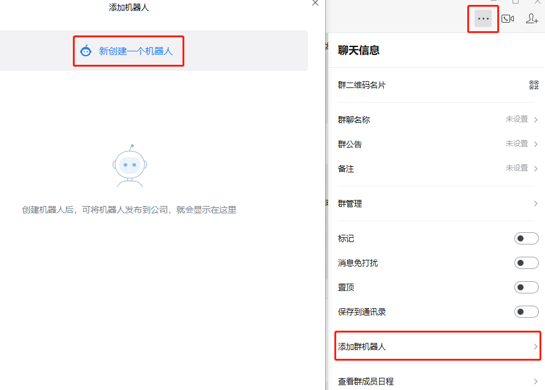
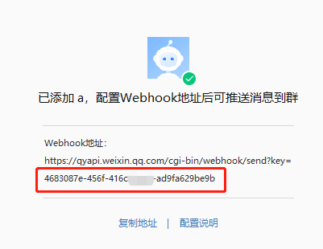
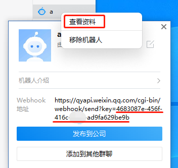
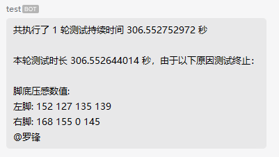
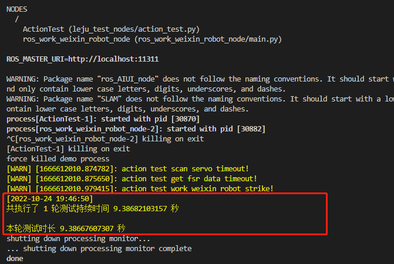

# 动作案例老化测试文档

## 目录

[一、参数配置](#参数配置)

[二、案例运行](#案例运行)

[三、测试结果](#测试结果)

### 参数配置

- 配置文件路径

    - /home/lemon/robot_ros_application/catkin_ws/src/leju_test_nodes/scripts/action_test/config/config.json

- 文件内容

    ``` json
        {
        "robotKey": "none", // 企业微信机器人的密钥，必填
        "phone": [],    // 要在企业微信中发消息 @ 的人的手机号，无需 @ 就不填
        "action_list": [    // 案例执行顺序，其中的案例需要在下面补充案例信息
            "下蹲",
            "举手",
            "跳舞",
            "太极"
        ],
        "下蹲": {   // 案例，需要和 action_list 的案例名一样，下同
            "action_file": "/home/lemon/robot_ros_application/catkin_ws/src/ros_actions_node/scripts/下蹲.py",  // 案例路径，下同
            "times": 3, // 单轮测试该案例需要执行的次数，下同
            "second_of_break_time": 3   // 案例执行之间的间隔时间，单位秒，下同
        },
        "举手": {
            "action_file": "/home/lemon/robot_ros_application/catkin_ws/src/ros_actions_node/scripts/举手.py",
            "times": 3,
            "second_of_break_time": 3
        },
        "跳舞": {
            "action_file": "/home/lemon/robot_ros_application/catkin_ws/src/ros_actions_node/scripts/Say-yeah舞蹈案例.py",
            "times": 1,
            "second_of_break_time": 3
        },
        "太极": {
            "action_file": "/home/lemon/robot_ros_application/catkin_ws/src/ros_actions_node/scripts/武当太极.py",
            "times": 1,
            "second_of_break_time": 3
        },
        "interval_time_per_round": 5,   // 每轮测试之间的间隔，单位秒
        "servo_id_with_normal_communication": [1, 2, 3, 4, 5, 6, 7, 8, 9, 10, 11, 12, 13, 14, 15, 16, 17, 18, 19, 20, 21, 22],  // 舵机扫描应该扫到的 id
        "temperature_protection_value": 65  // 舵机过温的临界值
        }
    ```

- 企业微信机器人密钥获取

    - 在企业微信新建群聊（因为至少需要拉 3 个人，可以在拉完 3 个人的群后，把不相关的人踢出群聊）

    - 添加机器人，输入机器人名字点击添加机器人

        

    - 添加成功后可以在弹出的窗口中获取机器人的密钥

        

    - 后续也可以通过查看资料的方式查看机器人的密钥

        

- 案例添加

    - 如添加 `摇头` 的案例：（部分不相关不需要修改配置文件的内容这里不展示）

    - 首先在 `action_list` 添加案例名称，如：
        ``` json
            "action_list": [    // 案例执行顺序，其中的案例需要在下面补充案例信息
            "下蹲",
            "举手",
            "跳舞",
            "太极", // 不要忘了添加逗号
            "摇头"  // 添加的案例名称
            ],
        ```

    - 然后添加 `摇头` 案例的信息：
        ``` json
            "摇头": {
            "action_file": "/home/lemon/robot_ros_application/catkin_ws/src/ros_actions_node/scripts/摇头.py",
            "times": 5, // 每轮测试跑 5 次
            "second_of_break_time": 5   // 每次之间休息 5 秒
            },
        ```

### 案例运行

- 运行文件路径

    - /home/lemon/robot_ros_application/catkin_ws/src/leju_test_nodes/launch/action_test.launch

- 运行命令

    ``` shell
    $ source ~/robot_ros_application/catkin_ws/devel/setup.bash
    $ roslaunch leju_test_nodes action_test.launch
    ```

### 测试结果

- 异常终止

    - 触发异常的情况

        - 舵机扫描缺少

        - 舵机超过温度限制

        - 脚底压感有数值为 0

        - 网络丢失连接

        

    - 终端会打印总的测试轮数、运行时长和本轮案例的运行时长，异常退出的原因，企业微信也有相同的提醒

- 手动终止

    - `ctrl c`

        

    - 终端会打印总的测试轮数、运行时长和本轮案例的运行时长，因为案例不是因为异常停止，不会有异常信息提示。企业微信在手动终止后不会再收到信息，最后一条信息为上一轮案例结束的信息

- 日志保存

    - 运行过程中的测试日志会保存在 `/home/lemon/fatigue_test` 中以时间戳命名的文件夹下
