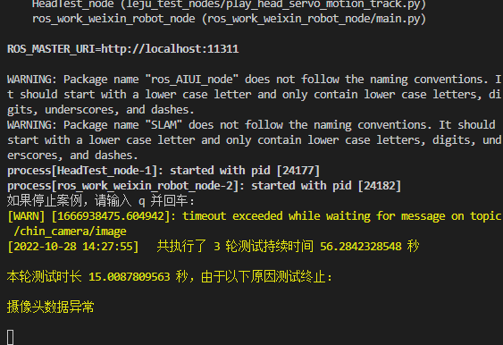
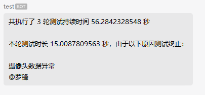
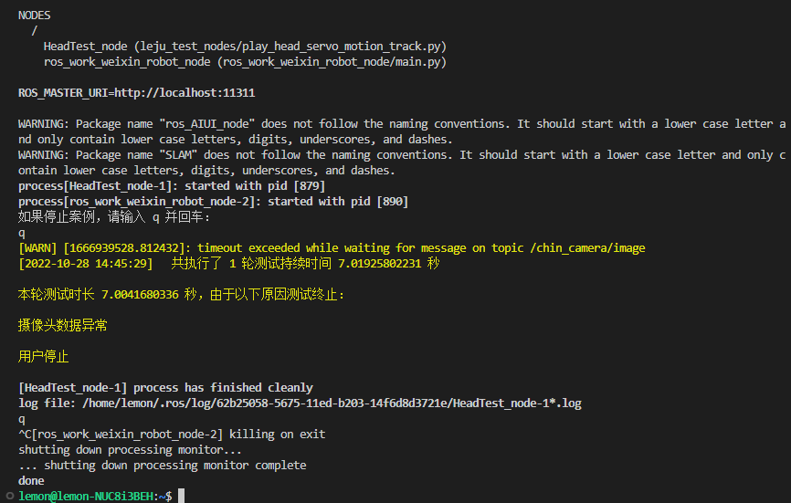
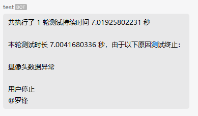

# 动作案例老化测试文档

## 目录

[一、参数配置](#参数配置)

[二、案例运行](#案例运行)

[三、测试结果](#测试结果)

### 参数配置

- 配置文件路径

    - /home/lemon/robot_ros_application/catkin_ws/src/leju_test_nodes/scripts/head_test/config/config.json

- 文件内容

    ``` json
        {
            "time_spent_once_catch_track": 0.2, // 录制（播放）舵机运动的采样间隔，单位秒
            "interval_time_per_round": 5,   // 每轮测试之间的间隔，单位秒
            "second_of_break_time": 3,  // 一轮里执行多次头部测试之间的时间间隔，单位秒
            "times": 3,     // 一轮需要执行的头部测试次数
            "servo_id_with_normal_communication": [1, 2, 3, 4, 5, 6, 7, 8, 9, 10, 11, 12, 13, 14, 15, 16, 17, 18, 19, 20, 21, 22],  // 舵机扫描应该扫到的 id
            "temperature_protection_value": 65, // 舵机过温的临界值
            "robotKey": "none", // 企业微信机器人的密钥，必填
            "phone": []     // 要在企业微信中发消息 @ 的人的手机号，无需 @ 就不填
        }
    ```

- 企业微信机器人密钥获取

    - 在企业微信新建群聊（因为至少需要拉 3 个人，可以在拉完 3 个人的群后，把不相关的人踢出群聊）

    - 添加机器人，输入机器人名字点击添加机器人

        

    - 添加成功后可以在弹出的窗口中获取机器人的密钥

        

    - 后续也可以通过查看资料的方式查看机器人的密钥

        

### 案例运行

- 录制头部运动轨迹

    - 运行录制头部运动轨迹脚本

        ``` shell
        $ source ~/robot_ros_application/catkin_ws/devel/setup.bash
        $ roslaunch leju_test_nodes record_head_track.launch
        ```

    - 根据提示，可以将头转动到开始位置，敲击回车键开始录制之后的头部运动轨迹

    - 停止录制头部运动轨迹需要在终端输入 `q` 再敲击回车键，即可退出录制脚本

- 播放头部运动轨迹

    - 运行播放头部运动轨迹脚本

        ``` shell
        $ source ~/robot_ros_application/catkin_ws/devel/setup.bash
        $ roslaunch leju_test_nodes play_head_track.launch
        ```

    - 脚本运行后，会根据配置文件的测试周期实现自动化测试。

    - 停止播放头部运动轨迹需要在终端输入 `q` 再敲击回车键，即可退出播放脚本

### 测试结果

- 异常终止

    - 触发异常的情况

        - 舵机扫描缺少

        - 舵机超过温度限制

        - 图像获取异常

        - 网络丢失连接

    - 终端会打印总的测试轮数、运行时长和本轮案例的运行时长，异常退出的原因

        

    - 企业微信也有相同的提醒

        

    - 此时敲击 `ctrl c` 并敲击回车，即可关闭测试脚本

- 手动终止

    - 先输入 `q` 并敲击回车，退出播放脚本，再敲击 `ctrl c` 退出 launch 文件的执行

    - 终端会打印总的测试轮数、运行时长和本轮案例的运行时长和检测结果

        

    - 企业微信会收到相同的测试信息和检测结果

        

- 日志保存

    - 运行过程中的测试日志会保存在 `/home/lemon/fatigue_test/head_test/` 中以时间戳命名的文件夹下
