# botec公司场地调试参考文档

### **程序更新**

- 机器人程序更新
  打开一个终端输入以下指令：

  ```shell
  sh -c "$(wget --no-cache http://roban.lejurobot.com/sys_update/download_sys_update.sh -O -)"
  ```
  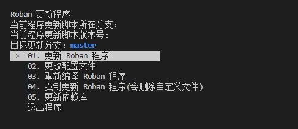

  出现这个界面选择:01更新roban程序或者04强制更新,等待更新完成即可.
  
- 子仓库拉取
  执行`cd ~/robot_ros_application`，进入到`~/robot_ros_application`目录,检查子仓库的文件夹是否存在,对应执行以下操作:
  | | 不存在 | 存在 |
  |---|---|---|
  | footstair | cd ~/robot_ros_application<br>git clone https://www.lejuhub.com/Talos/footstair.git --recursive<br>cd ~/robot_ros_application/footstair<br>catkin_make | cd footstair<br>git checkout master<br>git fetch<br>git pull<br>catkin_make |
  | pilewalk | cd ~/robot_ros_application<br>git clone https://www.lejuhub.com/hezhicheng/pilewalk.git --recursive<br>cd ~/robot_ros_application/pilewalk<br>catkin_make  | cd pilewalk<br>git checkout master<br>git fetch<br>git pull<br>catkin_make |

  
### **slam调试**

- **建图**

  - 建图脚本运行

    首先确保机器人开机启动的start.sh脚本正常运行:使用`rosnode list`看到`/camera/realsense2_camera`存在，或者直接重启一次机器人

    然后在vncviewer或直接接上屏幕打开一个终端输入：
    

    ```shell
    source ~/robot_ros_application/catkin_ws/devel/setup.bash
    rosrun SLAM RGBD true false
    ```
    
    命令最后的两个参数：
    
    1. true 代表显示预览窗口，false 代表不显示预览窗口
    2. false 代表建图模式，true 代表定位模式
    
    SLAM建图就启动了。
    
    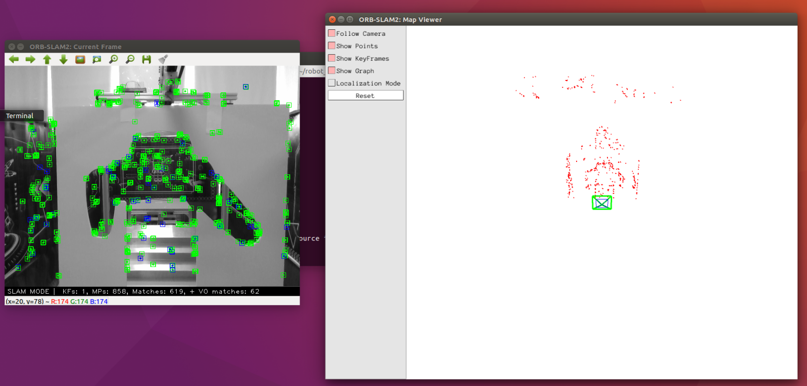
    左侧为相机图像，右侧为slam检测图像。如果看不到相机图像,需要检查`slam/src/SLAM/ORB_SLAM2/Examples/ROS/ORB_SLAM2/src/ros_rgbd.cc`文件中订阅的摄像头消息和相机节点的消息是否一致
     ```
     message_filters::Subscriber<sensor_msgs::Image> rgb_sub(nh, "/camera/color/image_raw", 1);
     message_filters::Subscriber<sensor_msgs::Image> depth_sub(nh, "/camera/depth/image_rect_raw", 1);
     ```

  - 缓慢移动机器人到如下图三个点，进行建图：

    

  - 建图过程中，在建图点，以行进方向为正方向，分别向左右两个方向以建图点为中心旋转45°左右，如下图：

    向左建图：

    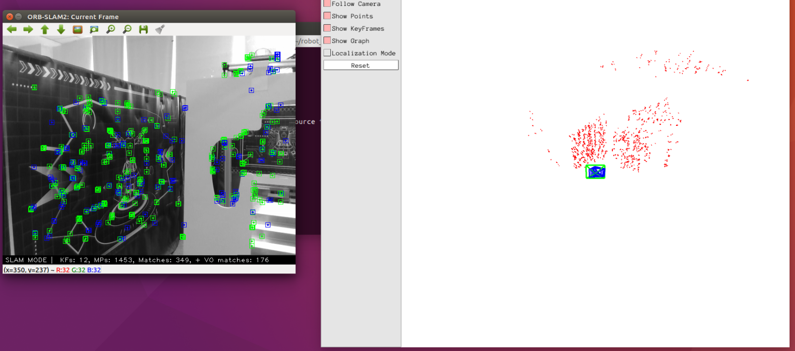

    向右建图：

    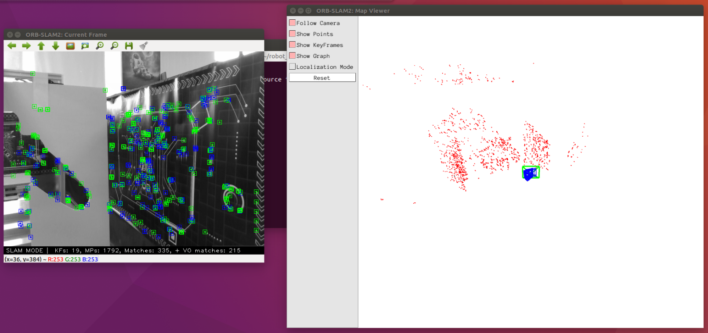

    按照上述方式，完成三个建图点的建图后，选中建图的终端，按"Ctrl+c"结束建图。

- 标点(slam位置标定)

  - 在vnc viwer终端运行：

    ```shell
    $ source ~/robot_ros_application/catkin_ws/devel/setup.bash
    $ rosrun SLAM RGBD true true
    ```

    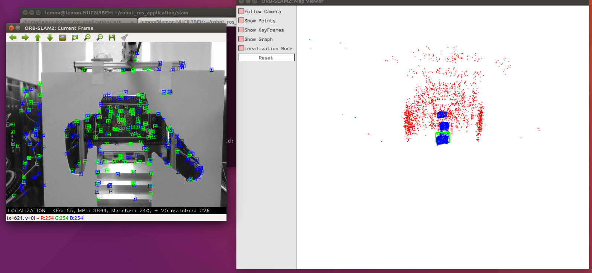

    打开刚刚建好的slam地图

  - 用vscode打开一个终端，运行：

    ```shell
    $ source ~/robot_ros_application/catkin_ws/devel/setup.bash
        
    $ rosrun ros_actions_node pose_board_company.py debug
    ```

    终端会不停刷新slam点位的数据

    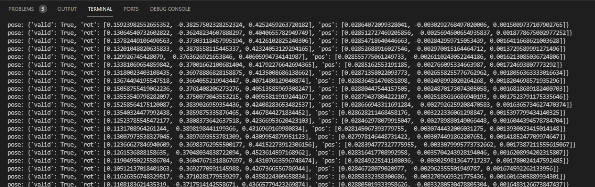

  - 修改`pose_board_company.py`文件

    文件路径为`~/robot_ros_application/catkin_ws/src/ros_actions_node/scripts/botec_company/pose_board_company.py`
    > vscode中按`ctrl+p`输入文件名或者路径可以快速打开这个文件

    需要修改如图两行数值：

    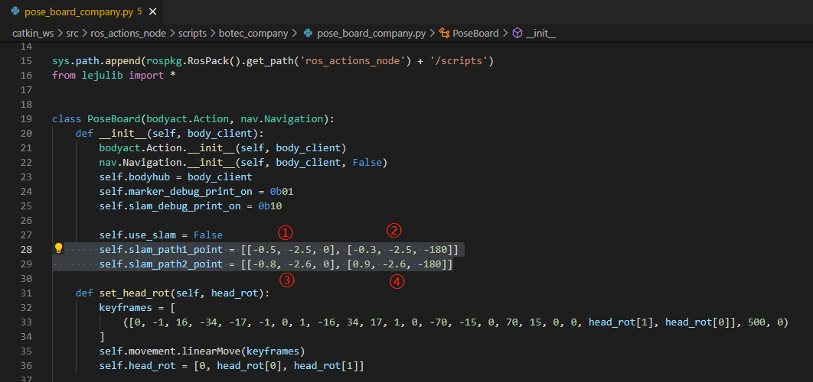

    self.slam_path1_point对应任意门artag的路段

    self.slam_path2_point对应走到楼梯跟前的路段

    两段路各由两个数据组成，对应如下图的四个点位

    

    将机器人依次放在上述点位上，依据终端打印的数据对应修改程序中的数值。

    如在①，终端打印数据如下图:

    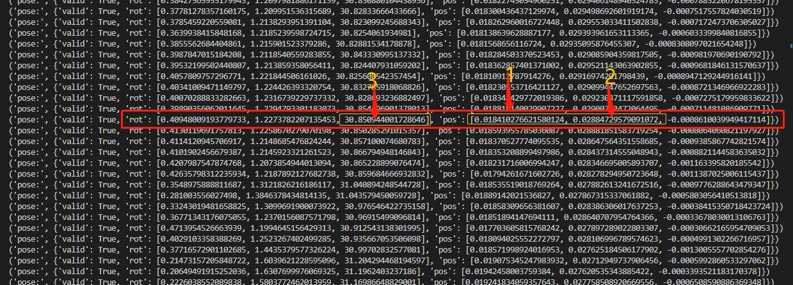

    以逗号作为分隔符，每个坐标为三部分，填入的数值分别是[x,y,yaw],x,y从pos中取得(上图中的1，2位置的值)，yaw偏航角从rot取得(上图中的3)，取合适值依次将数据替换到程序中
  
    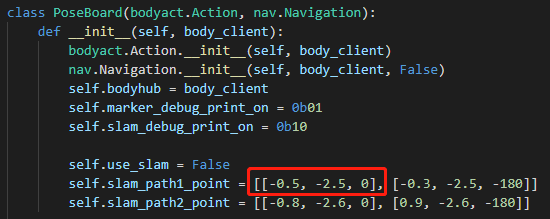
  
    完成四个点位的标定即完成slam建图及标定。
  
    保存pose_board_company.py，关闭slam程序终端（Ctrl+c），退出vs code执行的程序（Ctrl+c）。

### **artag调试**

​		artag码的作用是对机器人位置进行校正,比slam精度高些。

   将机器人放到artag码前

- 先运行artag检测脚本，在vs code终端输入：

  ```shell
  $ cd ~/robot_ros_application/catkin_ws/
  
  $ . devel/setup.bash
  
  $ roslaunch ar_track_alvar roban_chin_camera.launch
  ```

- 新建一个终端（ctrl+shift+`）输入：

  ```shell
  $ cd ~/robot_ros_application/catkin_ws/
  
  $ . devel/setup.bash
  
  $ rosrun ros_actions_node pose_board.py debug
  ```

  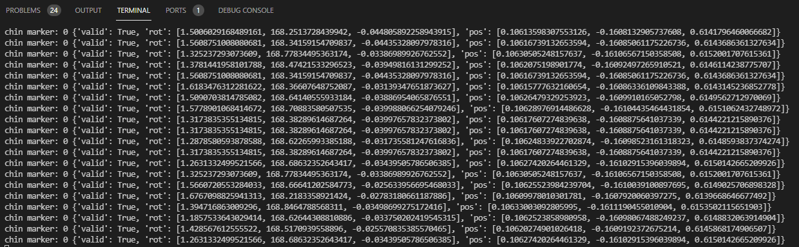

  可获得当前机器人看到artag码的位置数据

- 在pose_board_company.py需要修改两处

  脚本路径：
  `/home/lemon/robot_ros_application/catkin_ws/src/ros_actions_node/scripts/botec_company/pose_board_company.py`

    - 第一处/中间摆姿态的位置(任意门处)：
      将机器人放于任意门处的artag码前，位置终端打印出来位置之后填入下图中：(取[x,y,yaw]的值和slam标定类似)
        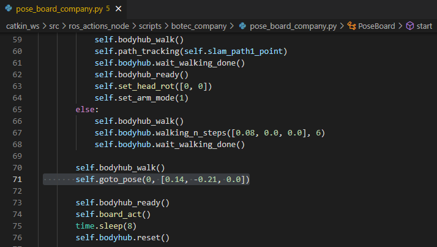
      如果没有输出可以尝试挪动位置，确保机器人下巴摄像头能够看到artag码。
    - 第二处/走楼梯前的位置：
      将机器人放于走楼梯前的artag码前，获取到终端位置输出填入下图位置
        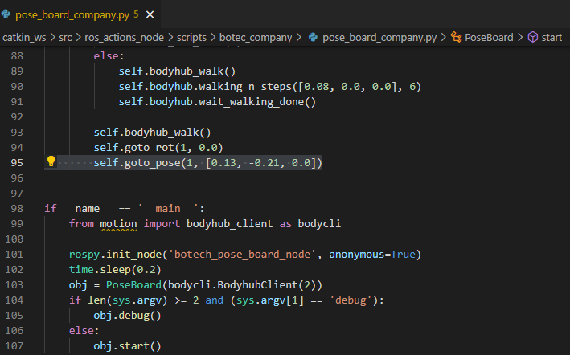

- navigation.py需要修改一处

  脚本位置：
  `/home/lemon/robot_ros_application/catkin_ws/src/ros_actions_node/scripts/botec/navigation.py`

  在走楼梯和梅花桩中间使用该脚本进行校正的，需要将2号tag码的位置(即梅花桩前的位置)填入下图中的"2"的位置。
  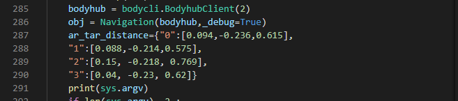

     > 要检验标定是否准确，可以在`/home/lemon/robot_ros_application/catkin_ws/src/ros_actions_node/scripts/botec/navigation.py`中填入artag码的位置，然后用`rosrun ros_actions_node navigation.py 0/1/2/3`命令运行，看机器人能否走到预定位置
      

- 机器人摆放位置：

  - 任意门处

    要求保证机器人能够完美通过。


    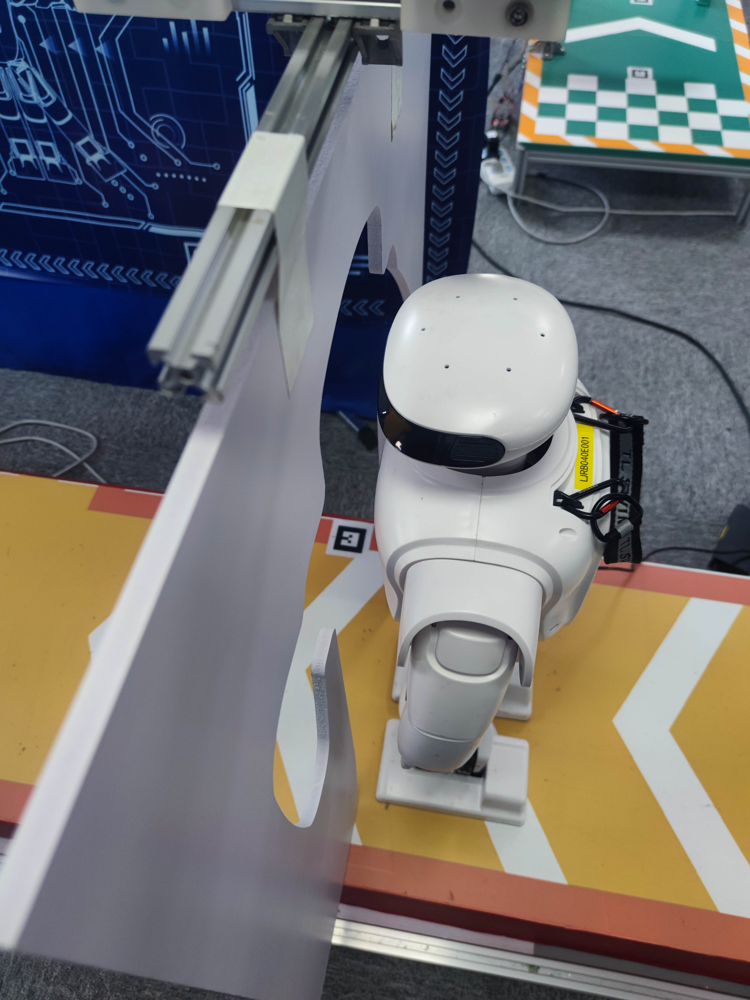


  - 楼梯处

    要求机器人离第一级台阶距离合适，走到楼梯跟前不会太近，导致踩到第一级台阶摔倒；也不可离第一级台阶距离太远，导致后续上台阶重心靠后摔倒。


    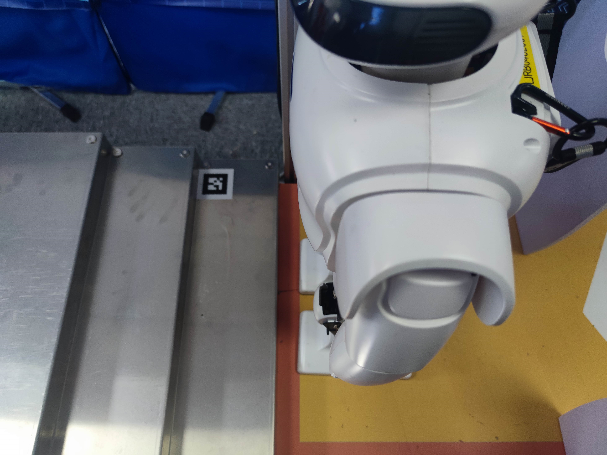


  - 梅花桩处

    要求右脚正对第一个桩，距离合适，若识别到下一个桩距离太远会导致机器人无法向前迈步。


    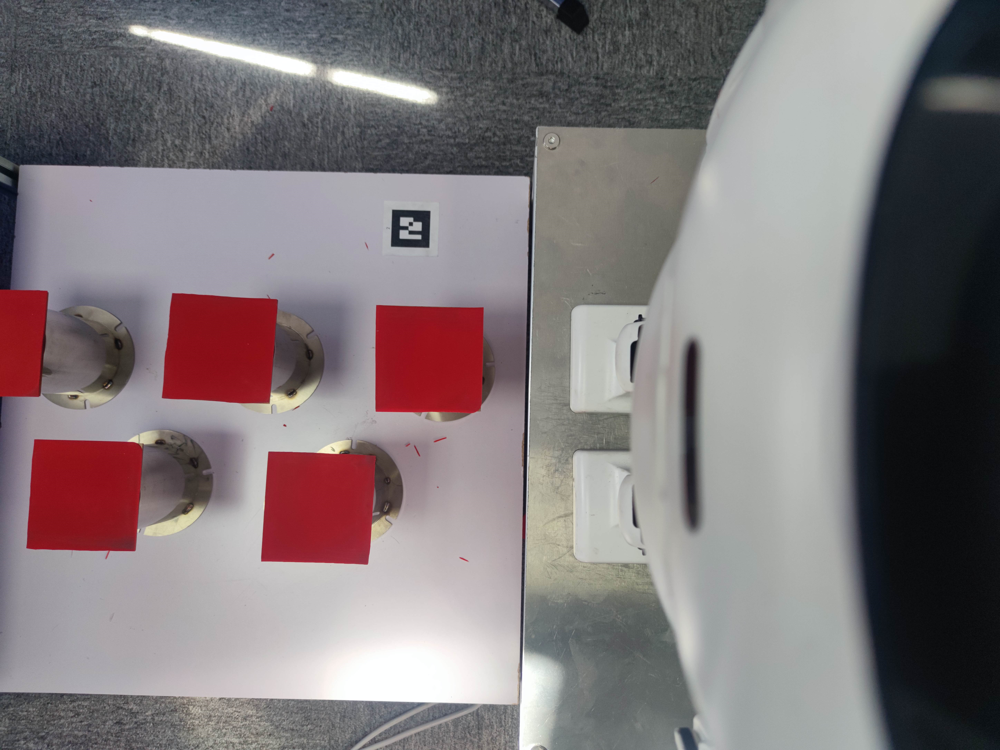


### **零点替换**

- 机器人零点位置：

  ```shell
  $ ~/.lejuconfig/offset.yaml
  ```

- 上楼梯零点替换

  - 上楼梯零点位置：

    ```shell
    $ ~/robot_ros_application/footstair/src/motion_interface/config/offset.yaml
    ```

  - 将机器人零点文件数值替换该文件数值

- 梅花桩零点替换

  - 梅花桩零点位置：
  
    ```shell
    $ ~/robot_ros_application/pilewalk/src/motion_interface/include/platform/roban/config/offset.yaml
    ```
  
  - 将机器人零点文件数值替换该文件数值

建图、标定和零点替换完成就可以运行`~/robot_ros_application/catkin_ws/src/ros_actions_node/scripts/shell/botec_company_demo.sh`文件对公司场地的三关进行连续演示啦：
打开终端运行：
```shell
bash ~/robot_ros_application/catkin_ws/src/ros_actions_node/scripts/shell/botec_company_demo.sh
```

## FAQ

- Q：标点时运行'rosrun ros_actions_node pose_board_botec.py debug'命令失败或报找不到这个文件。

  A：增加运行权限。

  ```shell
  $ cd ~/robot_ros_application/catkin_ws/src/ros_actions_node/scripts/botec_company
  $ chmod +x pose_board_company.py to_pile_company.py
  ```

