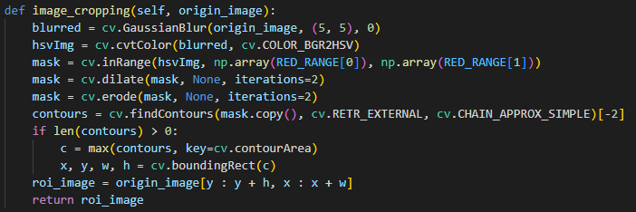
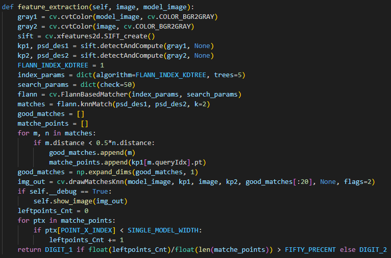
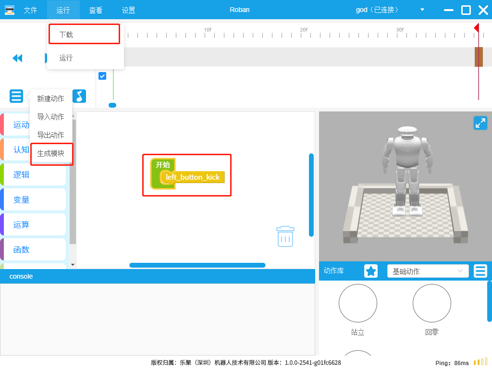
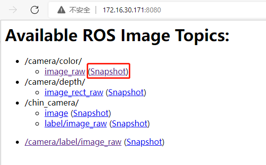
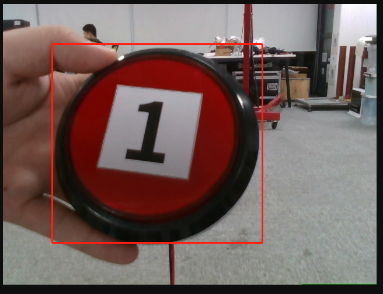

## 高职实训平台教案
- **教学题目**：实践-数字识别
- **课程名称**：高职实训平台教案
- **专业大类**：装备制造大类/电子信息大类
- **专业名称**：智能机器人技术/人工智能技术应用
- **授课班级**：
- **授课教师**：
- **学时安排**：2
- **本次授课的目的和要求**：
    - 了解数字识别的实现原理
    - 实现敲击预识别数字的按钮
- **本次授课的重点、难点及解决措施**
    - 重点：了解数字识别的实现原理
    - 难点：实现敲击预识别数字的按钮
    - 解决措施：
- **本次授课采用的教学方式、方法**
    - 讲授、事例
- **本次授课采用的教具、挂图及工具**
- **课后作业内容与估计完成时间**
    - 实现识别数字3和4，并敲击对应按钮。
- **思政一分钟**
    - 本节课有什么收获？
- **理论知识**
- **案例演示**
    - 在机器人中有数字识别的案例实现。
        ```shell
        cd robot_ros_application/catkin_ws/
        source devel/setup.bash
        rosrun ros_higher_vocational_training_platform kick_button.py
        ```

        

        输入你要识别的数字敲击回车，机器人会向左识别按钮的数字，如果不是目标数字，会敲击右边的按钮。

        你也可以用vnc-viwer软件或连接机器人的屏幕执行这个命令：

        ```shell
        cd robot_ros_application/catkin_ws/
        source devel/setup.bash
        rosrun ros_higher_vocational_training_platform face_tracking.py debug
        ```

        这会在系统中显示识别结果的图像。

        

- **部分代码解读**  
    - 主体结构

        

        代码的主体分为两部分，第一部分是控制头部的转动、模板图和相机图像的获取；第二部分调用了数字识别的模块，并执行对应识别结果的敲击动作。

    - 数字识别

        通过颜色识别截取按钮红色的外接矩形内的图片作为待处理图片。  
        

        

        用opencv特征匹配库计算待处理图片和模板的匹配程度。把匹配到的点的坐标根据x坐标区分来自模板的哪个数字，计算特征点在模板数字1和2分布的个数，占多的数字图片即为匹配结果。

    - 编辑动作替换动作文件

        用roban软件编辑动作，保存动作并放入开始模块下，点击下载，会在机器人的`/home/lemon/robot_ros_application/catkin_ws/src/ros_actions_node/scripts`目录下生成`temp.py`文件

        

        将该文件拷贝到`/home/lemon/robot_ros_application/catkin_ws/src/ros_higher_vocational_training_platform/scripts`目录下并更名为`right_button_kick.py`(敲击右侧按钮)和`left_button_kick.py`(敲击左侧按钮)。注意如果该目录已存在上述文件，先拷贝、更名或删除，以免发生错误。
  
    - 模板图片生成

        通过网页访问`机器人ip:8080`可以查看机器人摄像头的图像回传，点击`snapshot`可以截取一张摄像头的图像。

        

        我们分别将数字1和2通过此方法进行截取，注意我们截取的部分是红色按钮区域，并且截取的两张图尺寸要相同，可以借助聊天工具的截图工具进行截取，上面有截取区域尺寸的显示。

        截取完两张模板图后我们需要用到`synthetic_picture.py`进行图像的连接，该脚本在`/home/lemon/robot_ros_application/catkin_ws/src/ros_actions_node/scripts`目录下

        ```shell
        cd /home/lemon/robot_ros_application/catkin_ws/src/ros_actions_node/scripts
        python synthetic_picture.py show ${数字1图像所在路径} ${数字2图像所在路径}
        ```

        

        图像路径指向你截取模板图保存的路径，如在windows截取完图片保存命名为"1.jpg"和"2.jpg"，需要导入到机器人的系统中，可以将文件拖拽到vscode的目录列表中，比如放在`/home/lemon/robot_ros_application/catkin_ws/src/ros_actions_node/scripts`的目录下，那么我们输入的命令为：`python synthetic_picture.py show 1.jpg 2.jpg`

        `show`参数可以显示你连接后的图像，改为`save`即可在`/home/lemon/robot_ros_application/catkin_ws/src/ros_higher_vocational_training_platform/scripts/digits_model`目录保存连接的图像，命名为`new.png`，需要自行将该图片文件更名为`left_model.png`

- **实践目标**
    - 了解数字识别原理，实现识别数字3和4，并敲击对应按钮。

