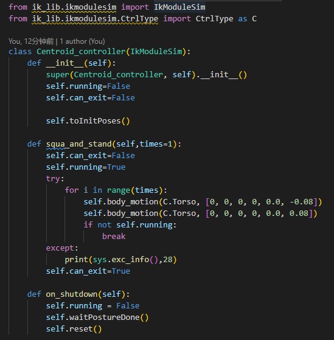

## 高职实训平台教案
- **教学题目**：实践-质心控制
- **课程名称**：高职实训平台教案
- **专业大类**：装备制造大类/电子信息大类
- **专业名称**：智能机器人技术/人工智能技术应用
- **授课班级**：
- **授课教师**：
- **学时安排**：1
- **本次授课的目的和要求**：
    - 了解质心控制机器人蹲下的实现原理
    - 学会使用逆解模块接口
- **本次授课的重点、难点及解决措施**
    - 重点：学会使用质心移动接口控制机器人蹲下起立
    - 难点：了解质心控制机器人蹲下的实现原理
    - 解决措施：
- **本次授课采用的教学方式、方法**
    - 讲授、事例
- **本次授课采用的教具、挂图及工具**
- **课后作业内容与估计完成时间**
    - 学会使用逆解模块其他接口实现机器人自定义动作
- **思政一分钟**
    - 本节课有什么收获？
- **理论知识**
- **案例演示**
    - 运行质心控制案例。
        ```shell
        cd ~/robot_ros_application/catkin_ws/
        source devel/setup.bash
        rosrun ros_higher_vocational_training_platform centroid_control.py 5
        ```
        机器人即进行蹲下起立动作，最后的参数5表示蹲下起立5次

    - 按下ctrl+c可以中止运行，机器人复位

- **部分代码解读**
    - 主体结构  
        质心控制主要通过调用leju_lib_pkg包中的逆解控制模块ik_lib.ikmodulesim实现

          
    
  - **ikmodulesim.py**

    class IkModuleSim(object):

    > 封装机器人逆解相关操作，主要使用 toInitPose ， body_motion 和 reset 方法。
    - 机器人位姿初始化

        ```python
        def toInitPoses(self):
            #机器人位姿初始化，在动作执行前调用
            #初始化成功 返回 True ,否则，返回 False
        ```

    - 机器人末端动作执行
        ```python
        def body_motion(self, body_pose, value, count=100):
            # 机器人末端动作执行，给定目标位姿 body_pose，value 通过逆解得到舵机角度，控制机器人运动
            Args:
                - body_pose: CtrlType, or [CtrlType] 
                        表示末端位置，如左/右脚(Lfoot/Rfoot)，身体中心(Torso)
                - value: list, or two dim list. RPY, xyz.
                        表示给相应末端的位姿值，[r, p, y, x, y, z]
                - count: int. times of division
                        插值次数，缺省为 100
        ```
        使用方法：需从ik_lib中导入 IkModuleSim 和 CtrlType， 然后新建一个类，继承自 IkModuleSim, 然后调用上述方法，完成自定义动作，示例如下：

        ```python
        import math
        import rospy
        from ik_lib.ikmodulesim import IkModuleSim
        from ik_lib.ikmodulesim.CtrlType import CtrlType as C
        
        class ClimbStairs(IkModuleSim):
            def __init__(self):
                super(ClimbStairs, self).__init__()
        
            def climb_stairs(self):
                # 重心下降 4cm
                self.body_motion(C.Torso, [0, 0, 0, 0, 0.0, -0.04])  
                # 重心向左腿偏移 12cm
                self.body_motion(C.Torso_y, 0.12)  
                # 右腿向上移动 5cm
                self.body_motion(C.Rfoot, [0, 0, 0, 0, 0.0, 0.05])  
                # 右腿向前20cm
                self.body_motion([C.Torso, C.Rfoot],
                                [[0, -math.pi / 8, 0, 0.0, 0, 0], 
                                    [0, 0, 0, 0.20, 0.0, 0.0]]) 
                # 右腿下2cm
                self.body_motion([C.Torso, C.Rfoot],
                                [[0, math.pi / 8, 0, 0.08, -0.12, 0.0], 
                                    [0, 0, 0, 0, 0.0, -0.02]])  
                # 抬左腿1
                self.body_motion([C.Torso, C.Lfoot], 
                                [[math.pi / 8, math.pi / 6, 0, 0.16, -0.10, 0.05],
                                    [0, -math.pi / 6, 0, 0.06, 0.0, 0.14]])  
                # 左腿向前20cm
                self.body_motion([C.Torso, C.Lfoot], 
                                [[0.0, -math.pi / 9, 0, -0.04, 0.0, 0.0],
                                    [0, math.pi / 6, 0, 0.14, 0.0, -0.05]])  
                # 复原
                self.body_motion([C.Torso, C.Lfoot],
                                [[-math.pi / 8, -math.pi / 18, 0, 0, 0.10, 0.02], 
                                    [0, 0, 0, 0.0, 0.0, -0.06]]) 
        ```
    - 动作复位
        ```python
        def reset(self):
            # 动作执行完后的复位，在动作完成后调用
        ```

- **实践目标**
    - 学会使用逆解模块其他接口实现机器人自定义动作

