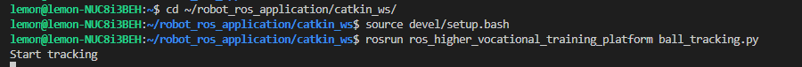
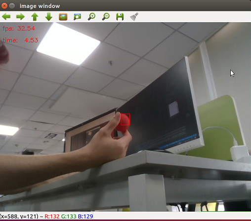
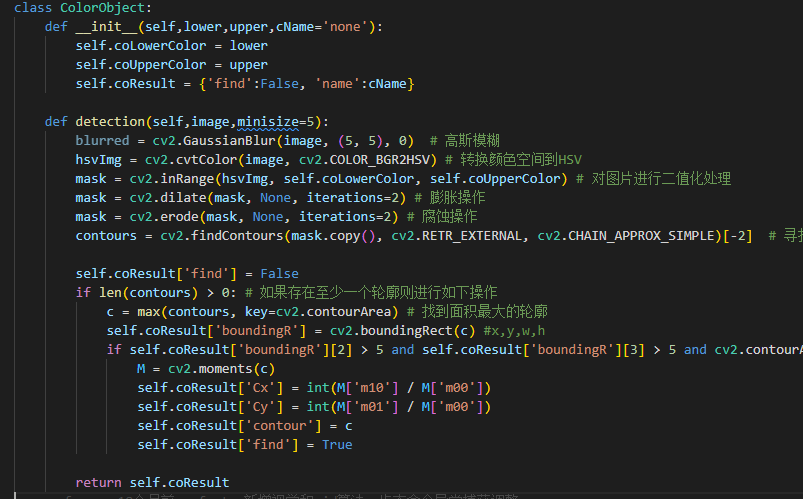
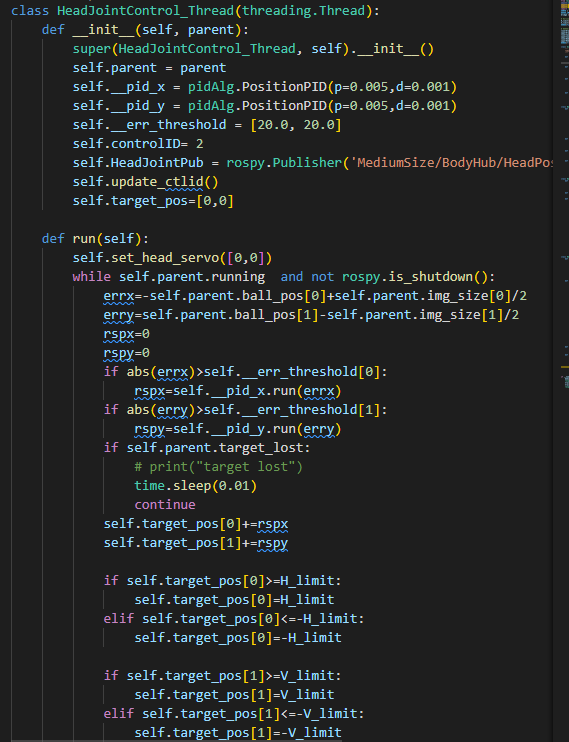

## 高职实训平台教案
- **教学题目**：实践-追踪小球
- **课程名称**：高职实训平台教案
- **专业大类**：装备制造大类/电子信息大类
- **专业名称**：智能机器人技术/人工智能技术应用
- **授课班级**：
- **授课教师**：
- **学时安排**：2
- **本次授课的目的和要求**：
    - 了解小球颜色识别的实现原理
    - 控制头部转向小球方位，让小球落于画面中心
    - 了解pid控制的基本原理和方法
- **本次授课的重点、难点及解决措施**
    - 重点：了解小球颜色识别的实现原理
    - 难点：使用pd控制器控制头部稳定跟踪小球
    - 解决措施：
- **本次授课采用的教学方式、方法**
    - 讲授、事例
- **本次授课采用的教具、挂图及工具**
- **课后作业内容与估计完成时间**
    - 调节pid控制器参数让小球从手中抛起仍然能跟踪到。
- **思政一分钟**
    - 本节课有什么收获？
- **理论知识**
- **案例演示**
    1. 运行追踪小球的脚本
        ```shell
        cd ~/robot_ros_application/catkin_ws/
        source devel/setup.bash
        rosrun ros_higher_vocational_training_platform ball_tracking.py
        ```
        

        也可以在vnc-viwer的终端运行传入debug参数显示识别结果：  
        ```shell
        cd ~/robot_ros_application/catkin_ws/
        source devel/setup.bash
        rosrun ros_higher_vocational_training_platform ball_tracking.py debug
        ```
        这会在屏幕中显示机器人摄像头的实时图像，识别出的小球结果会被一个红色矩形框起。  
        

        >由于光线、色差等原因可能预设的小球颜色阈值不合适，可以通过点击屏幕中的实时图像中小球的位置打印出小球当前的hsv值，然后围绕该值适当取一定的范围填入ball_tracking.py文件前部分的lowerRed和upperRed中

        

        将数字依次填入`lowerRed`或`upperRed`中，`lowerRed`表示最低的hsv颜色阈值，`upperRed`表示最高的hsv颜色阈值。

        

    2.拿出红色小球在摄像头前移动，可以看到Roban机器人头部会跟随小球转动。
        
        结束程序可以使用“ctrl + c”。  
        
- **部分代码解读**
    - 整体框架  
        小球追踪的流程大概是使用颜色识别识别出小球并计算中心位置->计算偏差使用pid控制器得到输出->发布头部动作->重新识别小球位置...如此循环实现一个闭环的控制。
        程序首先会在实例化一个Ball_tracker类的对象，类中会开辟两个线程分别用于颜色识别(Ball_detecter)和动作发布(HeadJointControl_Thread),同时会通过订阅摄像头的ROS主题`/camera/color/image_raw`获得摄像头图像。

    - 颜色识别(Ball_detecter类)  
        颜色识别主要调用了`~robot_ros_application/catkin_ws/src/leju_lib_pkg/src/vision/imageProcessing.py`中ColorObject的detection方法实现
          
        其中主要使用opencv对hsv图像进行二值化、膨胀、腐蚀等处理后，通过轮廓检测方法找出最大的颜色块的轮廓，然后找出其中心作为小球的中心位置。    
    - 动作发布(HeadJointControl_Thread类)
          
        在这个线程中，通过`self.parent.ball_pos`可以读取到不断更新的小球当前的位置。然后可以计算出小球位置相对于画面中心的偏差errx、erry，将偏差输入pid控制器self.__pid_x、self.__pid_y得到当前的控制量。由于发送给舵机的是位置数据，因此需要将控制量叠加到前一次的舵机位置中得到舵机的目标位置，同时需要对目标位置进行限制避免超出舵机能够到达范围，然后发布舵机目标位置`self.target_pos`即可控制机器人头部让小球落在画面中心位置。
- **实践目标**
    - 了解小球追踪的原理
    - 了解pid控制的基本原理和方法
