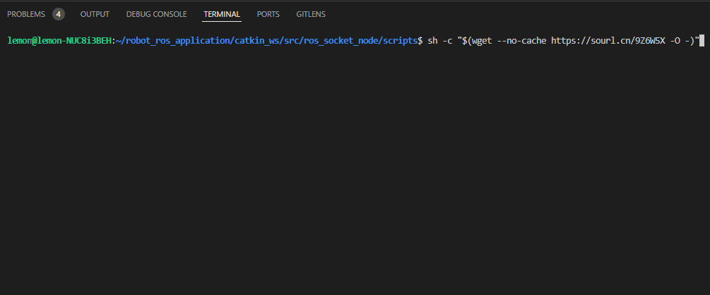
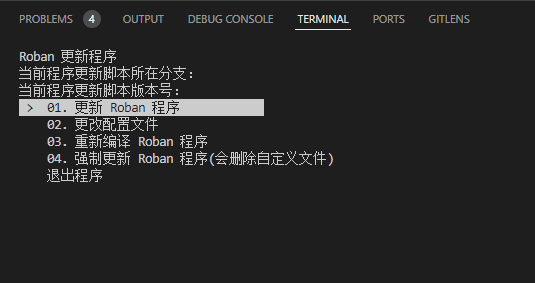
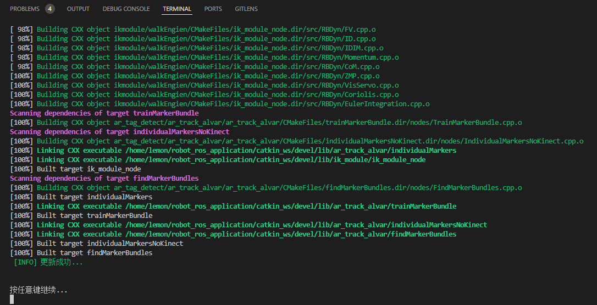
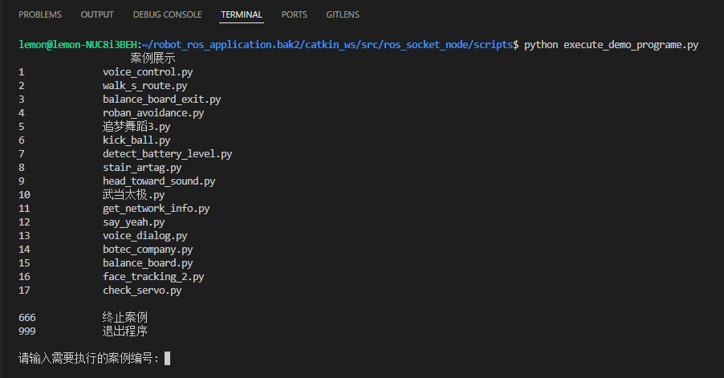
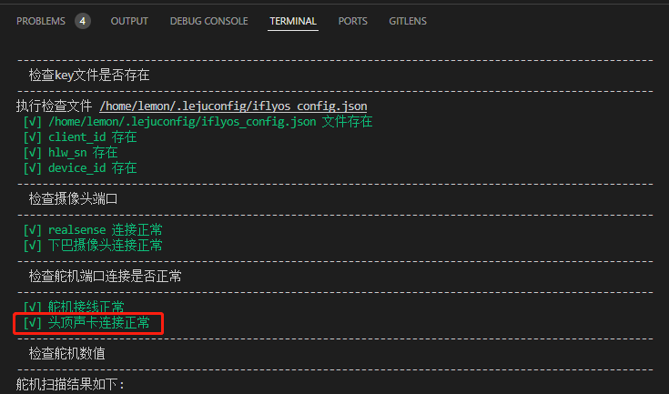
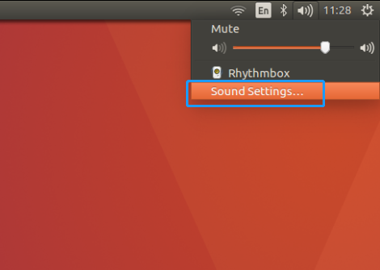
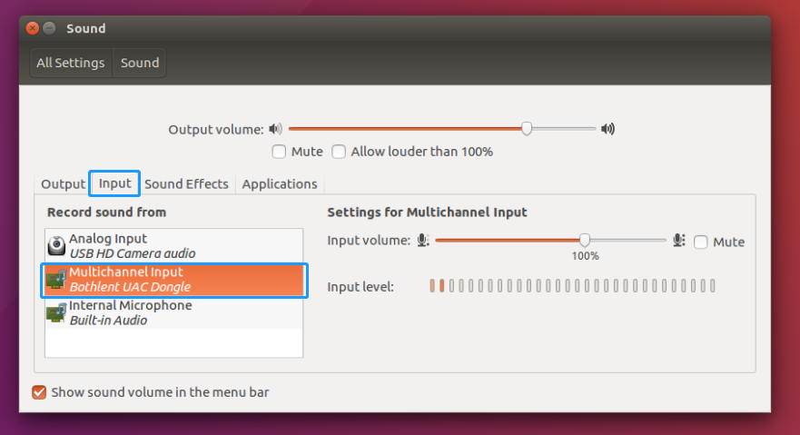
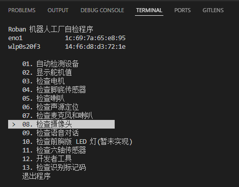
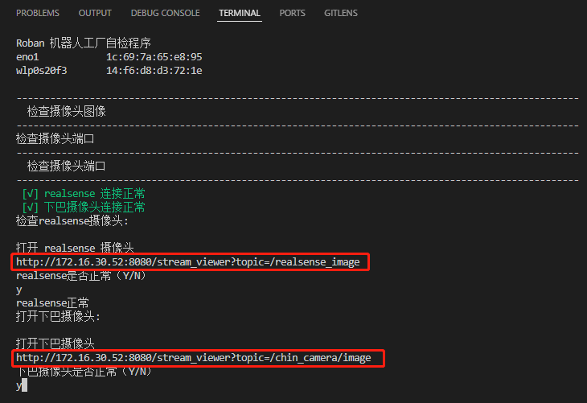

# 案例运行指南
### **更新机器人程序**（如果需要）
- ```shell
    $ sh -c "$(wget --no-cache https://sourl.cn/9Z6W5X -O -)"
    ```
      
    选择 “ 更新程序 ”   
       
    更新成功则显示 “ 更新成功 ”，敲任意键退出。如果更新失败，敲任意键退出并选择 “ 强制更新 ”
    
### **案例程序运行**
- ```shell
    cd ~/robot_ros_application/catkin_ws/src/ros_socket_node/scripts/
    python execute_demo_programe.py
    ```
### **使用说明**
- 程序界面
    - 
- 运行案例
    - 在提示的 “ 请输入需要执行的案例编号 ” 后输入案例对应的数字，敲击回车即可
- 结束当前执行的案例
    - 在提示的 “ 请输入需要执行的案例编号 ” 后输入 “ 666 ” ， 再敲击回车即可
- 退出程序
    - 在提示的 “ 请输入需要执行的案例编号 ” 后输入 “ 999 ” ， 再敲击回车即可


---
### **FAQ**
- 执行声源定位、语音控制和语音对话案例没有回应
    - 在终端输入 `check` ，选择 “ 01.自动检测设备 ” ，查看声卡是否正常  
          
        - 如果显示 “ 麦克风未设置默认 ” ，请连接显示器，点击右上角喇叭按钮，再点击 “ sound settings ”  
          
        选择 “ input ” ，再选择声卡 “ Bothlent UAC Dongle ”  
         
    - 重启机器人
    - 通过以上两步未解决，请联系工程师
- 执行踢球和人脸追踪无反应
    - 在终端输入 `check` ， 查看摄像头是否正常  
          
        - 按住 ctrl + 鼠标点击 链接可以弹出摄像头界面的窗口，如果无图像，则需要返修  
        

