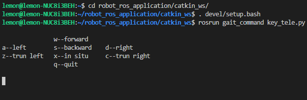

# 步态控制手册
- 程序运行
    - ```shell
        cd ~/robot_ros_application/catkin_ws/
        . devel/setup.bash
        rosrun gait_command key_tele.py
        ```
- 程序说明
    - 程序界面  
        
    - 使用说明
        - 按键对应走不同方向
        - | 按键 | 执行 |
          | --- | --- |
          | w | 向前走 |
          | a | 向左走 |
          | d | 向右走 |
          | s | 向后退 |
          | z | 向左转 |
          | c | 向右转 |
          | x | 原地踏步 |
          | q | 退出步态 |
        - 按住按键则一直执行，松开按键则停止执行，按住越长时间走越多步
