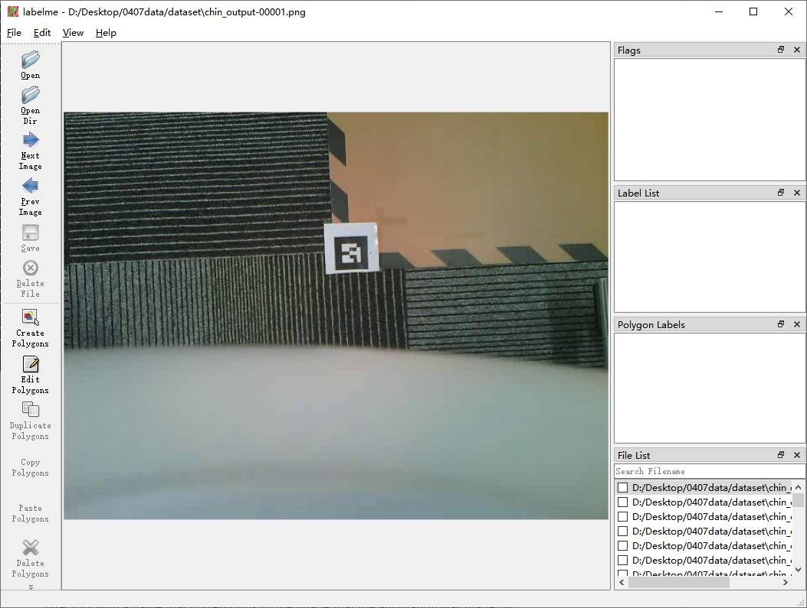
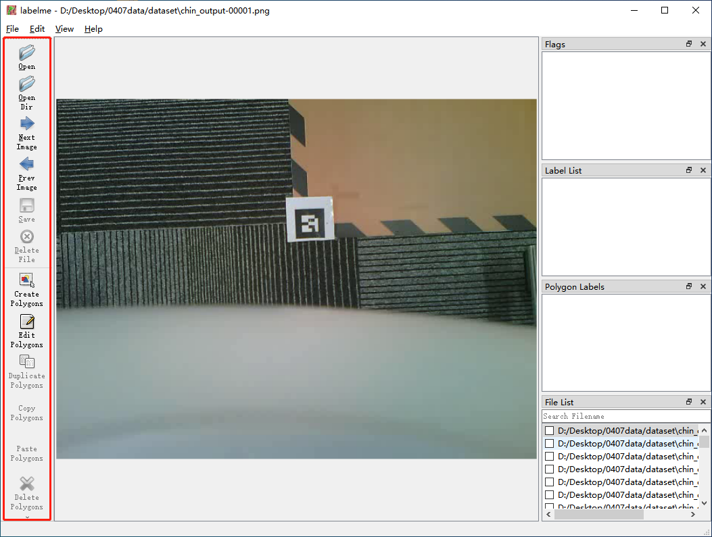

## labelme 标注数据集

### labelme 安装

- 官方安装教程 https://github.com/wkentaro/labelme#installation

    - Windows

        安装 [Anaconda](https://www.anaconda.com/products/distribution)，然后打开 Anaconda Prompt 执行以下命令

        ```shell
        conda create --name=labelme python=3
        conda activate labelme
        pip install labelme

        # or install standalone executable/app from:
        # https://github.com/wkentaro/labelme/releases
        ```

    - Ubuntu

        ```shell
        sudo apt-get install labelme

        # or
        sudo pip3 install labelme

        # or install standalone executable from:
        # https://github.com/wkentaro/labelme/releases
        ```

    - macOS

        ```shell
        brew install pyqt  # maybe pyqt5
        pip install labelme

        # or
        brew install wkentaro/labelme/labelme  # command line interface
        # brew install --cask wkentaro/labelme/labelme  # app

        # or install standalone executable/app from:
        # https://github.com/wkentaro/labelme/releases
        ```

### 数据标注

- 打开 labelme（如 Windows 打开 Anaconda Prompt 输入 labelme 回车）

    - 软件启动后界面如下

        

    - 菜单 File

        

        - Open Dir

            - 打开你要标注的数据的文件夹

        - Save Automatically

            - 自动保存 (建议选中)

        - Change Output Dir

            - 保存标注的 json 文件，创建一个新的文件夹保存

    - 工具栏

        

        - Next Image、Prev Image

            - 下一张图片、上一张图片

        - Create Polygons

            - 创建多边形，用于标注

        - Edit Polygons

            - 编辑多边形，用于标注

- 标注步骤

    - 点击 Create Polygons ，将目标区域框出来，首位相连后会弹出标签的选择框，选择或新建一个标签

        

    - 点击 OK 后，预览中会显示刚刚标注的框，右边会显示标签列表

        

    - 保存后，在 File List 会在文件前的框打勾

